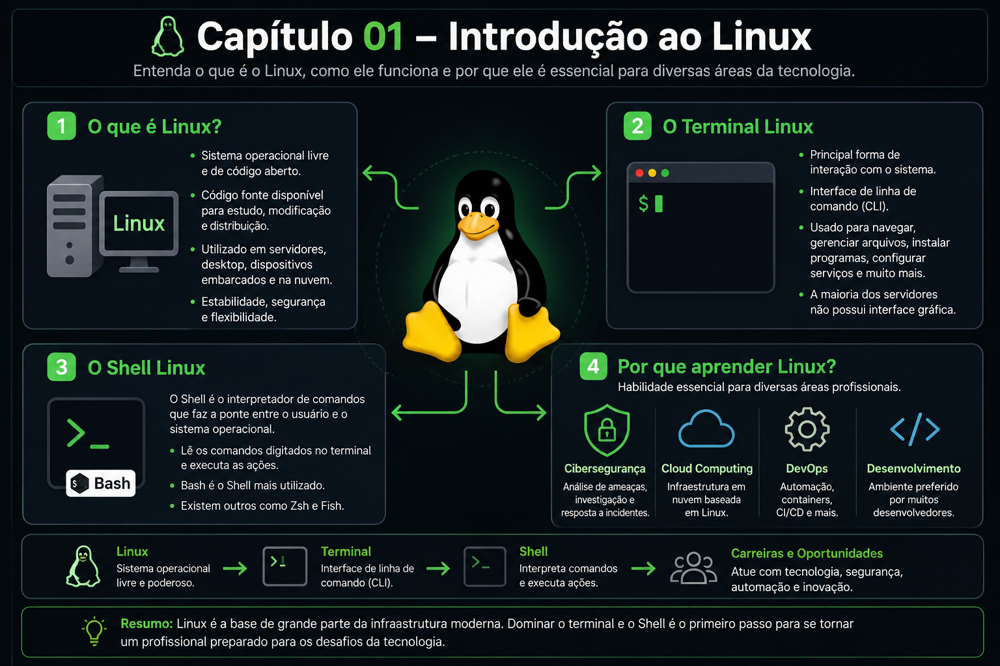

# 🐧 Chapter 01 – Introduction to Linux

  

## What is Linux?

Linux is a free and open-source operating system...

## What is Linux?

Linux is a free and open-source operating system that has become one of the foundations of modern computing. Because its source code is publicly available, developers around the world can study, modify, and improve it for a wide range of purposes.

Today, Linux powers enterprise servers, cloud platforms, software development environments, cybersecurity infrastructures, embedded systems, and millions of other devices. Its stability, security, flexibility, and performance have made it one of the most widely used operating systems in the world.

---

## The Linux Terminal

The Linux terminal is the primary interface for interacting with the operating system. Although many Linux distributions provide a graphical user interface (GUI), most production servers are managed through the command-line interface (CLI).

Using the terminal, users can navigate the file system, manage files and directories, install software, configure services, monitor running processes, and perform system administration tasks efficiently.

---

## The Linux Shell

The Shell is the command interpreter that acts as the interface between the user and the Linux operating system. It reads commands entered in the terminal and executes the requested actions.

The **Bash (Bourne Again Shell)** is the default shell in many Linux distributions, although other popular shells, such as **Zsh** and **Fish**, are also widely used.

The Shell is one of the most powerful tools in Linux because it offers:

* **Flexibility:** Nearly every aspect of the operating system can be managed through command-line tools.
* **Automation:** Bash scripts automate repetitive tasks, increasing efficiency and productivity.
* **Efficiency:** Many operations are faster to perform using commands than through graphical interfaces.
* **Powerful Tools:** Utilities such as `grep`, `find`, `awk`, and `sed` enable advanced searching, filtering, and text processing.
* **Remote Administration:** Combined with SSH, the Shell allows secure remote management of Linux systems from virtually anywhere.

---

## Why Learn Linux?

Linux is an essential skill for professionals working in Cybersecurity, Software Development, DevOps, Cloud Computing, and System Administration.

Building a solid foundation in Linux enables professionals to manage systems, automate workflows, investigate security incidents, deploy applications, and work confidently in modern IT environments.

